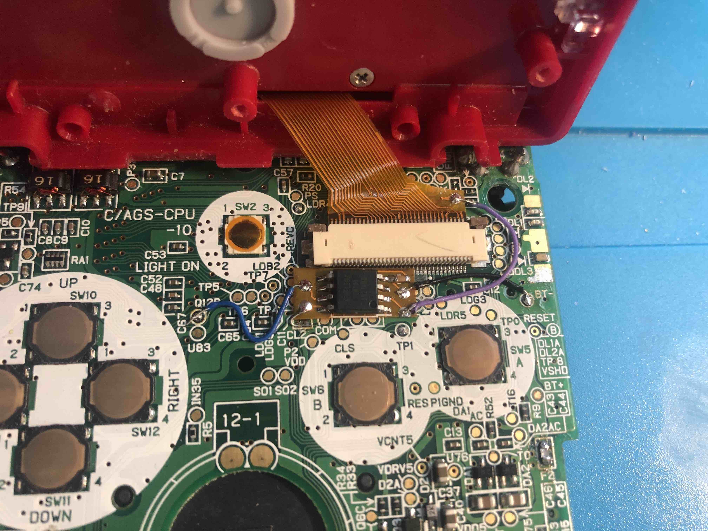

# SP-IPS-Brightness-Hack
Save your brightness settings on the FunnyPlaying SP IPS screen kit. The IPS kit always boots up at brightness level 4 out of 6. The microcontroller intercepts presses of the brightness button to store the current brightness. When you turn the SP on, the microcontroller will automatically adjust the screen's brightness to your previous setting.

Uses [this board](https://github.com/orangeglo/Tiny85_SP_Breakout), or a bare ATtiny85.

